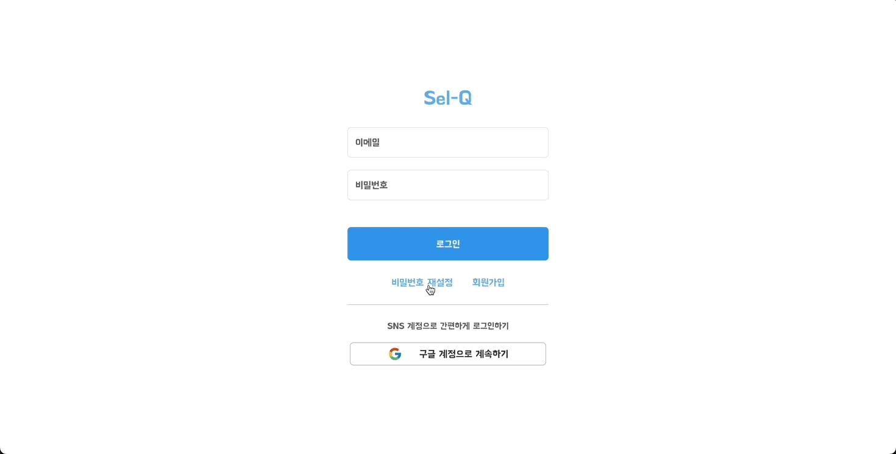

<p align='middle'>
  
</p>

## [배포 레포로 이동 ➡️](https://github.com/osdoonhyun/SEL-Q)

프로젝트 기술 스택, 인프라 구성도, 버전 설명 보러가기!

### 📌 목차

[1. 서비스 소개](#-서비스-소개)  
[2. 기술 스택](#-기술-스택)  
[3. 아키텍쳐](#-아키텍쳐)  
[4. 폴더 구조](#-폴더-구조)  
[5. 주요 기능 및 페이지 소개](#-주요-기능-및-페이지-소개)  
[6. 커밋 컨벤션](#-커밋-컨벤션)  
[7. 관련 포스팅](#-관련-포스팅)

## 🔎 서비스 소개

신입 개발자라면 꼭 알아야 할 내용들을 일문일답 형식으로 문제은행화 하였습니다.<br>Sel-Q에서 제공하는 다양한 기능을 활용하여 사용자가 스스로 학습을 진행할 수 있도록 도와주는 서비스입니다.<br>
질문과 답변 형식으로 프론트엔드 개발자가 갖춰야 할 개발 지식, 상식의 내용을 **문제 은행 방식으로 스스로에게 질의응답**하여 학습한 내용을 더욱 효과적으로 정리하고 상기되도록 설계하였습니다.

## 🛠️ 기술 스택

### 프론트엔드


### 인프라


## 🏛️ 아키텍쳐


## 🌳 폴더 구조

```
📦src
┃
┣ 📂assets : 폰트 및 아이콘
┃
┣ 📂components : 공통 컴포넌트 및 페이지 컴포넌트
┃
┣ 📂config : 쿠키 설정
┃
┣ 📂constant : 상수 데이터
┃
┣ 📂context : 폰트 설정 Context API
┃
┣ 📂hooks : React Custom Hooks 및 React Query Hooks
┃
┣ 📂pages : 페이지 모음
┃
┣ 📂routes : 라우팅 설정
┃
┣ 📂services : API 호출 함수
┃
┣ 📂store : Redux Store 및 Slices
┃
┣ 📂styles : styled-Components 및 Global Styles
┃
┗ 📂utils : 유틸 함수
```

## 💻 주요 기능 및 페이지 소개

> 페이지 클릭 시 큰 화면에서 보실 수 있습니다.

<table>
	<tbody>
    <tr>
			<th colspan="2"><strong>[ Common ]</strong></th>
		</tr>
		<tr>
			<th>메인 페이지</th>
			<th>질문 목록 / 상세 페이지</th>
		</tr>
		<tr>
			<td></td>
			<td></td>			
		</tr>		
		<tr>
			<td>- 랜덤 질문 돌리기를 통해 스스로 학습하는 페이지<br>- 힌트, 답변 제공<br>- 카테고리 필터링 기능</td>
			<td>- 전체 질문 모아보기<br>- 카테고리 캐러셀 기능<br>- 질문에 대한 힌트와 답변 기능을 통해 스스로 학습하는 기능(상세페이지)</td>
		</tr>	
		<tr>
			<th>중요 질문 페이지</th>
			<th>로그인 페이지</th>
		</tr>
		<tr>
			<td></td>
			<td></td>
		</tr>		
		<tr>
			<td>- 중요도 확인 후 학습하는 기능<br>- 페이지네이션 기능<br>- 중요도 선택 기능 (필터링)</td>
			<td>- 일반 / 소셜 로그인 기능<br>- 유효성 검사 기능</td>
		</tr>	
		<tr>
			<th>비밀번호 재설정 페이지</th>
			<th>회원가입 페이지</th>
		</tr>
		<tr>
			<td></td>
			<td></td>
		</tr>		
		<tr>
			<td>- 이메일 인증(가입 유저 확인)<br>- 비밀번호 재설정 기능</td>
			<td>- 일반 / 소셜 회원가입<br>- 이메일 인증<br>- 유효성 검사</td>
		</tr>	
    <tr>
			<th colspan="2"><strong>[ User Side (Logged In) ]</strong></th>
		</tr>
		<tr>
			<th>북마크 페이지</th>
			<th>마이페이지</th>
		</tr>
		<tr>
			<td></td>
			<td></td>
		</tr>
		<tr>
			<td>- 유저 인증 기능<br>- 북마크 기능<br>- 북마크한 질문 모아보기</td>
			<td>- 개인 프로필 관리<br>- 계정 탈퇴 기능</td>
		</tr>
    <tr>
			<th colspan="2"><strong>[ Admin Side ]</strong></th>
		</tr>
		<tr>
			<th>질문 등록 페이지</th>
			<th>유저 관리 페이지</th>
		</tr>
		<tr>
			<td></td>
			<td></td>
		</tr>
		<tr>
			<td>- 단계별 질문 등록 기능<br>- 등록 진행 상태 표시 Progress Bar 구현<br>- 유효성 검사<br>- 작성 중 임시 저장 / 불러오기</td>
			<td>- 전체 유저 관리<br>- 유저 프로필 조회 / (닉네임, 등급)수정 / 삭제<br>- 닉네임 / 날짜 / 권한 필터링 기능<br>- 페이지네이션 기능</td>
		</tr>
		<tr>
			<th>질문 관리 페이지</th>
			<th>질문 관리 페이지 (필터링)</th>
		</tr>
		<tr>
			<td></td>
			<td></td>
		</tr>
		<tr>
			<td>- 전체 질문 관리<br>- 질문 수정 / 삭제 기능</td>
			<td>- 전체 질문 관리<br>- 카테고리 / 중요도 / 날짜 필터링 기능<br>- 페이지네이션 기능</td>
		</tr>
		<tr>
			<th colspan="2"><strong>[ 그 외 기능들 ]</strong></th>
		</tr>
		<tr>
			<th>반응형 UI 기능</th>
			<th>글자 크기 설정 기능</th>
		</tr>
		<tr>
			<td></td>
			<td></td>
		</tr>
		<tr>
			<td>- 모든 페이지 반응형 UI 지원</td>
			<td>- 글자 크기 설정 기능(축소, 기본, 확대)</td>
		</tr>
		<tr>
			<th>질문 검색 기능</th>
			<th></th>
		</tr>
		<tr>
			<td></td>
			<td></td>
		</tr>
		<tr>
			<td>- 질문 검색 기능</td>
			<td></td>
		</tr>
	</tbody>

</table>

<br>

## ⚙️ 커밋 컨벤션

> 개발은 혼자 진행했지만, 통일성과 체계적인 관리를 위해 커밋 컨벤션을 적용

- `feat` : 새로운 기능 추가
- `fix` : 새로운 기능 추가
- `docs` : 문서 수정
- `style` : 코드 포맷팅, 필요 없는 주석 제거
- `refactor` : 코드 리팩토링
- `test` : 테스트
- `chore` : 빌드 수정, 패키지 매니저 수정
- `rename` : 파일 혹은 폴더명 수정, 옮기는 작업
- `remove` : 파일 삭제

## 📚 관련 포스팅

[사용자 우아하게 입력하기(feat. 퍼널 패턴)](https://velog.io/@osdsoonhyun/%ED%8D%BC%EB%84%90-%ED%8C%A8%ED%84%B4%EC%9D%84-%ED%99%9C%EC%9A%A9%ED%95%98%EC%97%AC-%ED%95%9C-%EB%B0%A9%EC%97%90-%ED%8E%98%EC%9D%B4%EC%A7%80-%EA%B4%80%EB%A6%AC%ED%95%98%EA%B8%B0)

[Sequence Diagram으로 보는 토큰 만료 시나리오(with JWT 토큰, Axios Interceptors)](https://velog.io/@osdsoonhyun/JWT-%ED%86%A0%ED%81%B0-%EA%B4%80%EB%A6%AC%EB%A5%BC-%EC%9C%84%ED%95%9C-Axios-Interceptors%EC%99%80-API-%EC%9A%94%EC%B2%AD-%EC%84%A4%EC%A0%95)
